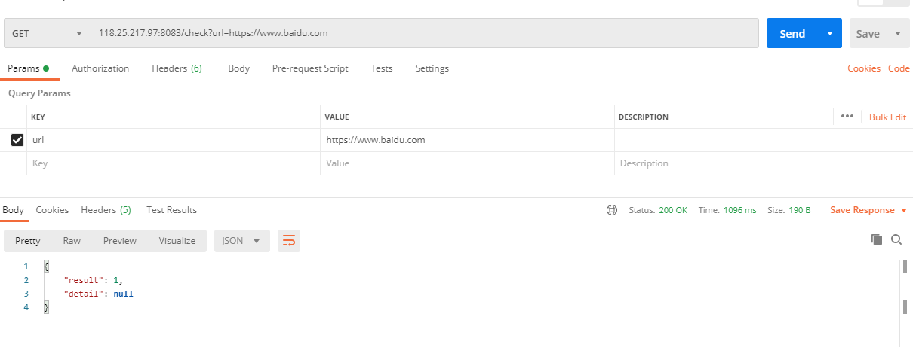
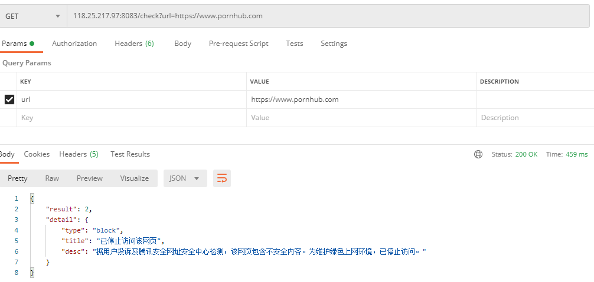

# 微信和QQ域名检测

简单微信和QQ域名检测实现

### 使用

项目部署后 
1. 微信域名检测： 访问/check?url=xxx 其中xxx为要检测的域名
2. qq域名检测：访问/qqCheck?url=xxx 其中xxx为要检测的域名

返回值为json

```json
{
  "result": 1,
  "detail":{}
}
```
其中result = 1 为正常访问， result = 2 为不能正常访问

### 试用

可以访问 118.25.217.97:8083/check 和 118.25.217.97:8083/qqCheck 试用
  
  
  
